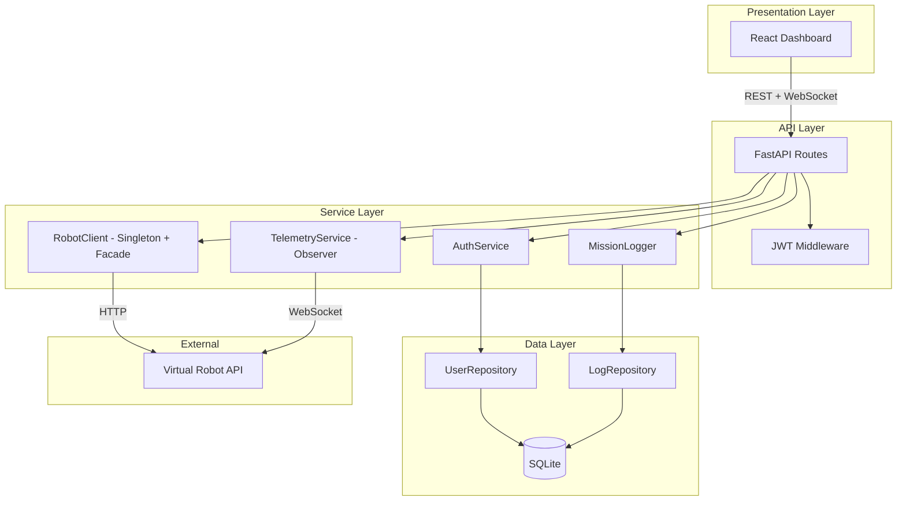

# System Architecture — CMP9134 Robot GCS

## Architectural Pattern: Layered Architecture + Client-Server

This system follows a **Layered Architecture** combined with a **Client-Server** 
pattern. The frontend React application acts as a thin client, communicating 
exclusively with the FastAPI backend over REST and WebSocket. The backend is 
itself layered into four distinct tiers, each with a single responsibility. 
No layer can skip another — the API layer never touches the database directly, 
and the data layer never contains business logic.

The choice of a separate frontend and backend (rather than server-side rendering) 
was deliberate. It allows the two components to be developed, tested, and 
containerised independently, and it supports a clean separation of concerns that 
maps directly to the Observer and Repository design patterns used in the backend.

## Layer Responsibilities

| Layer | Technology | Responsibility |
|---|---|---|
| Presentation | React + TypeScript + Tailwind | Renders UI, manages WebSocket connection to backend, sends REST commands |
| API | FastAPI (Python) | Handles HTTP routing, JWT authentication, RBAC enforcement, WebSocket relay |
| Service | Python classes | Business logic — robot client, telemetry service, auth service, audit logger |
| Data | SQLAlchemy + SQLite | Persists users and mission logs, abstracts all database access |

## Design Patterns Applied

| Pattern | Where | Purpose |
|---|---|---|
| Singleton | `RobotClient` | Single shared HTTP client instance across the app |
| Facade | `RobotClient` | Hides raw HTTP calls behind clean methods like `move(x, y)` |
| Observer | `TelemetryService` | Notifies WebSocket subscribers when new telemetry arrives |
| Repository | `UserRepository`, `LogRepository` | Abstracts database queries from business logic |

## Architecture Diagram

