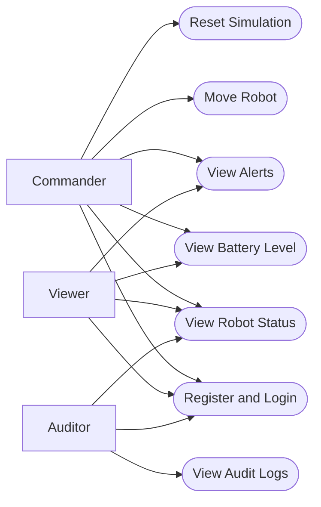
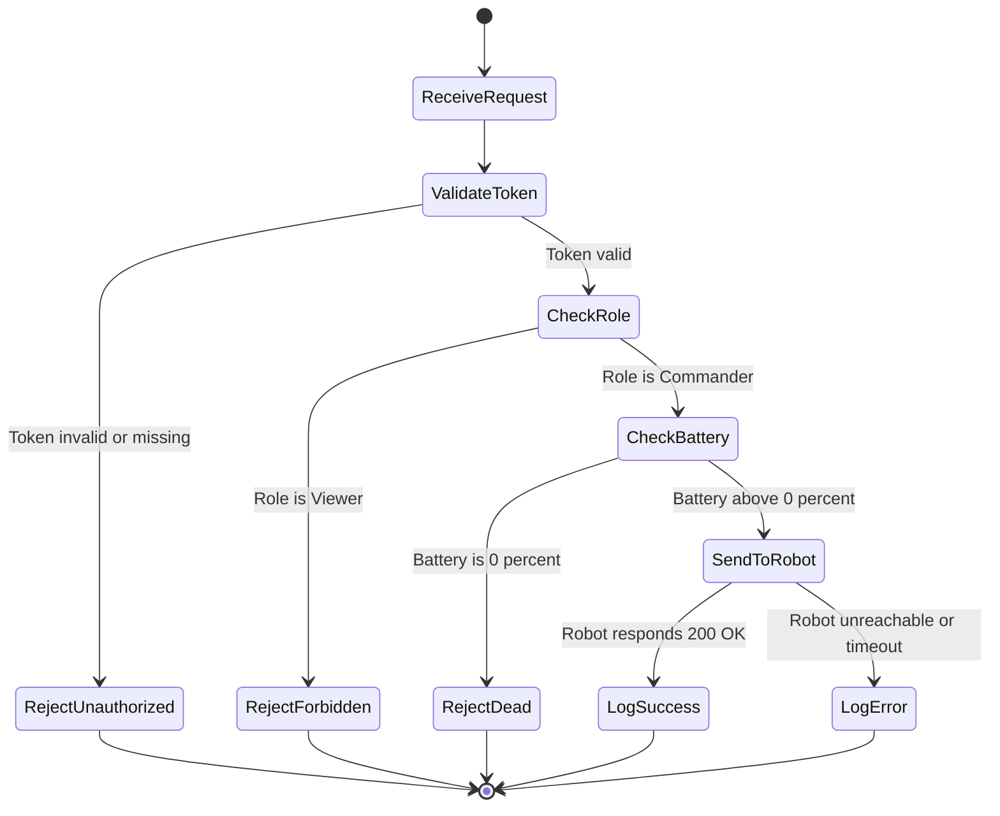
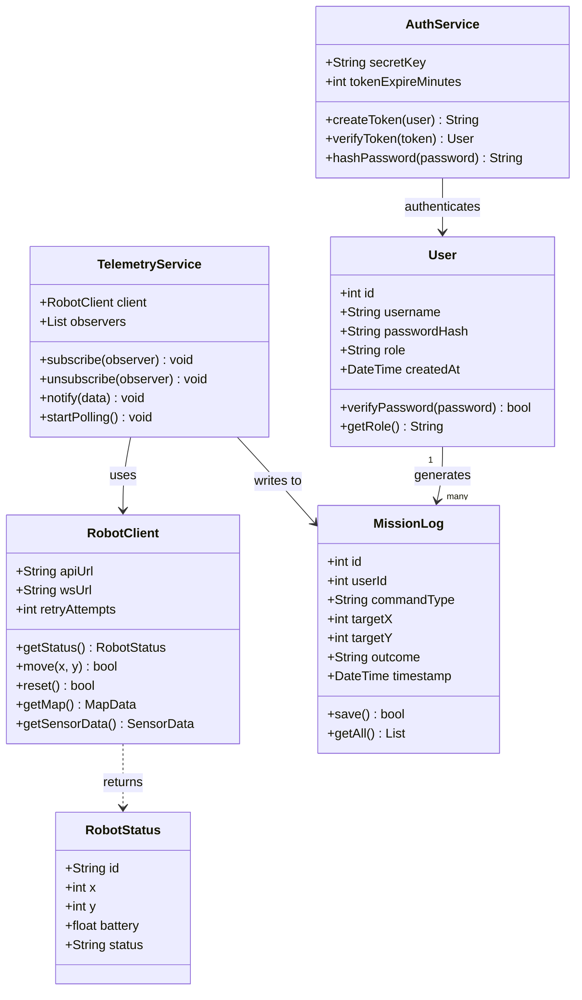
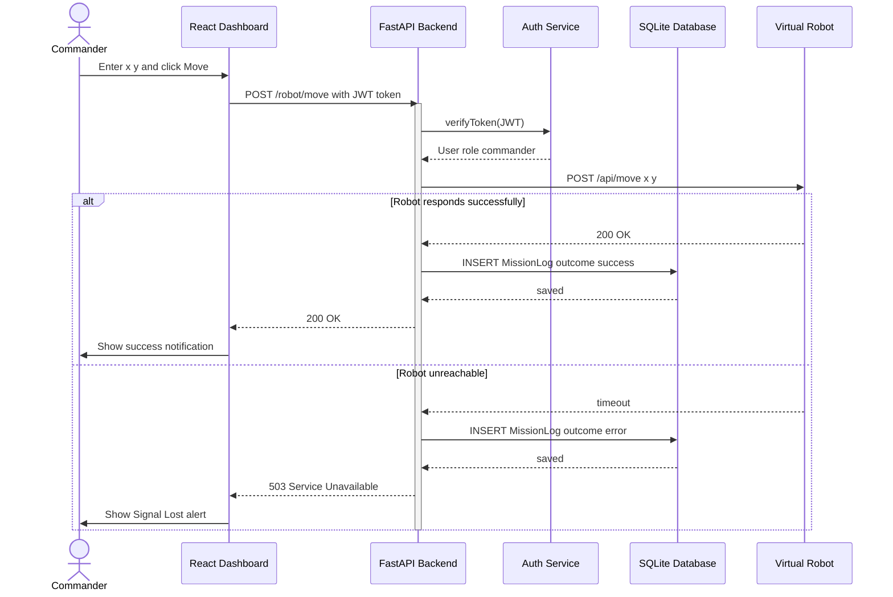

# UML Diagrams — CMP9134 Robot GCS

## 1. Use Case Diagram

```mermaid
flowchart LR
    C[Commander]
    V[Viewer]
    A[Auditor]

    Auth([Register and Login])
    Status([View Robot Status])
    Battery([View Battery Level])
    Alerts([View Alerts])
    Move([Move Robot])
    Reset([Reset Simulation])
    Logs([View Audit Logs])

    C --> Auth
    C --> Status
    C --> Battery
    C --> Alerts
    C --> Move
    C --> Reset

    V --> Auth
    V --> Status
    V --> Battery
    V --> Alerts

    A --> Auth
    A --> Status
    A --> Logs
```

---

## 2. Activity Diagram — Move Command Authorization

```mermaid
stateDiagram-v2
    [*] --> ReceiveRequest
    ReceiveRequest --> ValidateToken

    state ValidateToken <<choice>>
    ValidateToken --> RejectUnauthorized : Token invalid or missing
    ValidateToken --> CheckRole : Token valid

    state CheckRole <<choice>>
    CheckRole --> RejectForbidden : Role is Viewer
    CheckRole --> CheckBattery : Role is Commander

    state CheckBattery <<choice>>
    CheckBattery --> RejectDead : Battery is 0 percent
    CheckBattery --> SendToRobot : Battery above 0 percent

    state SendToRobot <<choice>>
    SendToRobot --> LogSuccess : Robot responds 200 OK
    SendToRobot --> LogError : Robot unreachable or timeout

    RejectUnauthorized --> [*]
    RejectForbidden --> [*]
    RejectDead --> [*]
    LogSuccess --> [*]
    LogError --> [*]
```

---

## 3. Class Diagram

```mermaid
classDiagram
    class User {
        +int id
        +String username
        +String passwordHash
        +String role
        +DateTime createdAt
        +verifyPassword(password) bool
        +getRole() String
    }

    class RobotClient {
        +String apiUrl
        +String wsUrl
        +int retryAttempts
        +getStatus() RobotStatus
        +move(x, y) bool
        +reset() bool
        +getMap() MapData
        +getSensorData() SensorData
    }

    class RobotStatus {
        +String id
        +int x
        +int y
        +float battery
        +String status
    }

    class MissionLog {
        +int id
        +int userId
        +String commandType
        +int targetX
        +int targetY
        +String outcome
        +DateTime timestamp
        +save() bool
        +getAll() List
    }

    class TelemetryService {
        +RobotClient client
        +List observers
        +subscribe(observer) void
        +unsubscribe(observer) void
        +notify(data) void
        +startPolling() void
    }

    class AuthService {
        +String secretKey
        +int tokenExpireMinutes
        +createToken(user) String
        +verifyToken(token) User
        +hashPassword(password) String
    }

    User "1" --> "many" MissionLog : generates
    RobotClient ..> RobotStatus : returns
    TelemetryService --> RobotClient : uses
    TelemetryService --> MissionLog : writes to
    AuthService --> User : authenticates
```

---

## 4. Sequence Diagram — Move Command

```mermaid
sequenceDiagram
    actor C as Commander
    participant UI as React Dashboard
    participant API as FastAPI Backend
    participant Auth as Auth Service
    participant DB as SQLite Database
    participant Sim as Virtual Robot

    C->>UI: Enter x y and click Move
    UI->>API: POST /robot/move with JWT token
    activate API
    API->>Auth: verifyToken(JWT)
    Auth-->>API: User role commander
    API->>Sim: POST /api/move x y
    alt Robot responds successfully
        Sim-->>API: 200 OK
        API->>DB: INSERT MissionLog outcome success
        DB-->>API: saved
        API-->>UI: 200 OK
        UI->>C: Show success notification
    else Robot unreachable
        Sim-->>API: timeout
        API->>DB: INSERT MissionLog outcome error
        DB-->>API: saved
        API-->>UI: 503 Service Unavailable
        UI->>C: Show Signal Lost alert
    end
    deactivate API
```

